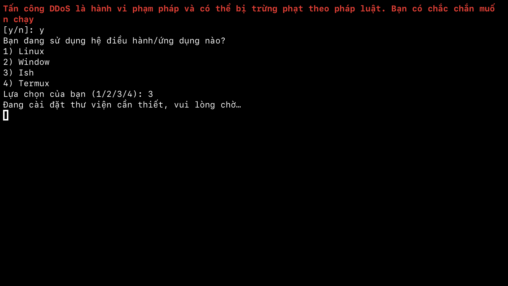
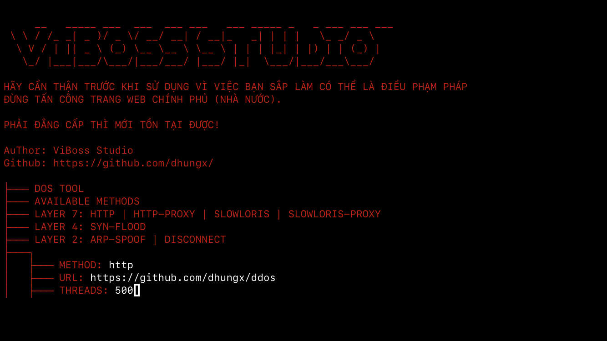

# DDoS Script

## Tùy chọn thiết bị

- **Dành cho máy mạnh.**
- *[Máy yếu ở đây](https://github.com/dhungx/...)*

---

Dự án này là một công cụ tấn công từ chối dịch vụ (DDoS). Mục tiêu là tối ưu hóa tốc độ gửi yêu cầu để tạo ra tải trọng lớn lên máy chủ mục tiêu.

<div align="center">
  <h2>DEMO</h2>
  
  
</div>

## Cài Đặt

1. **Clone Repository**

   ```bash
   git clone https://github.com/dhungx/ddos.git
   cd ddos
   python3 setup.py
   ```
   Chạy
```bash
python3 ddos.py
```

## Cảnh Báo

⚠️ **Sử dụng công cụ này chỉ trên máy chủ mà bạn có quyền kiểm soát hoặc đã được phép thử nghiệm.**  
Việc sử dụng công cụ này mà không có sự cho phép có thể vi phạm pháp luật và các điều khoản dịch vụ.
**Tác giả sẽ không chịu trách nhiệm nào về bất cứ hậu quả pháp lý nào mà bạn gây ra.**
Công cụ này tạo ra chỉ để nhăm mục đích học tập và tham khảo.

## Đóng Góp

Nếu bạn muốn đóng góp vào dự án này, hãy gửi Pull Request hoặc mở một Issue để thảo luận về các thay đổi.

## Giấy Phép

Dự án này được cấp phép theo Giấy phép MIT. Xem file [LICENSE](LICENSE) để biết thêm chi tiết.

## Thông Tin
[Telegram](https://t.me/dhungx)